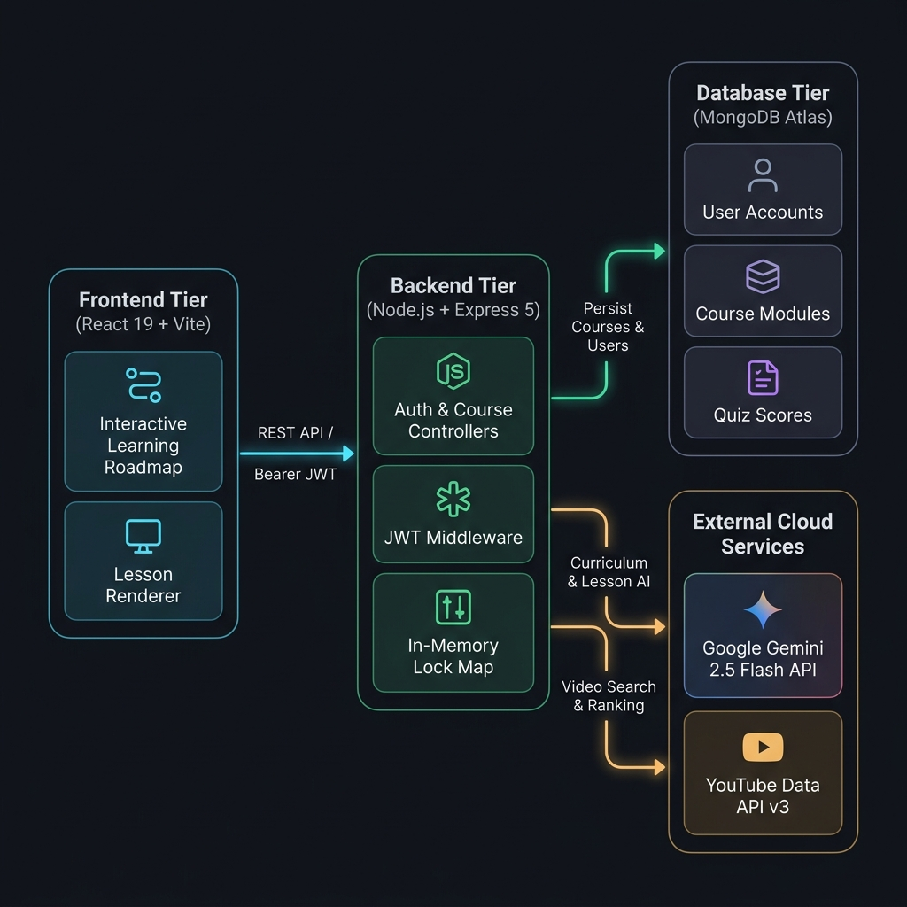

# Text-to-Learn: AI-Powered Course Generator

**Text-to-Learn** is a full-stack, AI-driven learning platform that transforms any learning topic into a structured, interactive curriculum.

Users can enter a topic such as **React, Data Structures, Dynamic Programming, CSS Flexbox, Machine Learning, Photography, or Culinary Arts**, and the platform generates a progressive learning experience consisting of modules, lessons, practical examples, knowledge-check MCQs, YouTube tutorials, progress tracking, and a visual learning roadmap.

The platform uses **Google Gemini 2.5 Flash** for AI-powered curriculum and lesson generation, **YouTube Data API v3** for educational video discovery, **MongoDB Atlas** for persistent data storage, and a React-based interactive roadmap for course navigation and progress visualization.

---

## Key Features

### 1. Dynamic Topic-Aware Curriculum Generation

Converts a user's input topic into a structured curriculum containing:

- 4 learning modules
- 4 lessons per module
- Progressive topic coverage
- A final assessment module

The curriculum is generated dynamically based on the requested topic rather than relying on a fixed course structure.

Example topics include:

- React
- Dynamic Programming
- CSS Flexbox
- Machine Learning
- Data Structures
- Photography
- Culinary Arts

---

### 2. Interactive Visual Learning Roadmap

The course interface includes an interactive visual roadmap implemented using:

- `LearningRoadmap.jsx`
- React
- CSS
- `html-to-image`

The roadmap provides:

- Module navigation
- Expand/collapse module sections
- Lesson completion status
- Course progress visualization
- Active lesson highlighting
- Interactive lesson nodes
- High-resolution PNG roadmap export

---

### 3. On-Demand AI Lesson Generation

Lessons are generated on demand using Google Gemini.

Each lesson can contain:

- Beginner-friendly explanations
- Learning objectives
- Practical examples
- Syntax-highlighted code blocks for technical topics
- Interview Tips
- Common Mistakes
- Best Practices
- Pro Tips
- Scenario-based MCQs

Technical code examples are rendered using **Prism Syntax Highlighter**.

---

### 4. Semantic YouTube Video Integration

The backend integrates with the **YouTube Data API v3** to find relevant educational videos.

The application uses a filtering and scoring approach to improve video relevance by considering factors such as:

- Topic relevance
- Video title and description
- Educational content
- Video duration
- Channel relevance
- Exclusion of Shorts
- Exclusion of music, memes, and reaction-oriented content

The selected videos are displayed inside lessons using a responsive 16:9 video player.

---

### 5. Print-Optimized PDF Export

The application uses the browser's native **Print-to-PDF** workflow through `window.print()`.

Dedicated `@media print` styles transform the application into a print-friendly document layout.

The print stylesheet provides:

- White document background
- Black readable text
- Formatted callouts
- Formatted code blocks
- Print-friendly spacing
- Removal of unnecessary dashboard elements
- Prevention of clipped lesson content

---

### 6. Progress Tracking and Quiz Scoring

User learning progress is persisted in MongoDB.

The system tracks:

- Completed lessons
- Course progress
- Quiz scores
- User-specific course data

Progress is associated with authenticated users and persists across sessions.

---

### 7. JWT-Based Authentication and Protected API Routes

The application uses custom authentication rather than an external authentication provider.

Authentication is implemented using:

- `bcryptjs` for password hashing
- `jsonwebtoken` for JWT creation and verification
- Bearer tokens for authenticated API requests
- Protected backend routes

The frontend stores authenticated user information locally and sends the JWT with protected API requests.

---

## 🏗️ System Architecture

Text-to-Learn follows a full-stack architecture where the React frontend communicates with a Node.js/Express backend. The backend handles authentication, course generation, lesson generation, progress tracking, and integrations with Google Gemini and the YouTube Data API. MongoDB Atlas is used for persistent storage.

The architecture diagram was generated using **[Archify](https://github.com/tt-a1i/archify)** by analyzing the actual project codebase to document the relationships between the application's components.



### Repository Directory Structure

```text
Text-to-Learn/

│
├── client/                         # React + Vite Frontend
│   │
│   ├── src/
│   │   ├── components/
│   │   │   ├── Layout.jsx
│   │   │   ├── Sidebar.jsx
│   │   │   ├── LessonRenderer.jsx
│   │   │   └── LearningRoadmap.jsx
│   │   │
│   │   ├── context/
│   │   │   └── AuthContext.jsx
│   │   │
│   │   ├── pages/
│   │   │   ├── Home.jsx
│   │   │   ├── CoursePage.jsx
│   │   │   ├── ModulePage.jsx
│   │   │   ├── LessonPage.jsx
│   │   │   ├── Login.jsx
│   │   │   ├── Signup.jsx
│   │   │   └── ForgotPassword.jsx
│   │   │
│   │   └── utils/
│   │       └── api.js
│   │
│   ├── index.css
│   ├── App.jsx
│   ├── main.jsx
│   ├── package.json
│   └── vite.config.js
│
└── server/                         # Node.js + Express Backend
    │
    ├── config/
    │   └── db.js
    │
    ├── controllers/
    │   ├── authController.js
    │   └── courseController.js
    │
    ├── middleware/
    │   └── authMiddleware.js
    │
    ├── models/
    │   ├── User.js
    │   └── Course.js
    │
    ├── routes/
    │   ├── authRoutes.js
    │   ├── courseRoutes.js
    │   └── debugRoutes.js
    │
    └── services/
        ├── aiService.js
        ├── youtubeService.js
        └── domainRoadmaps.js
```
